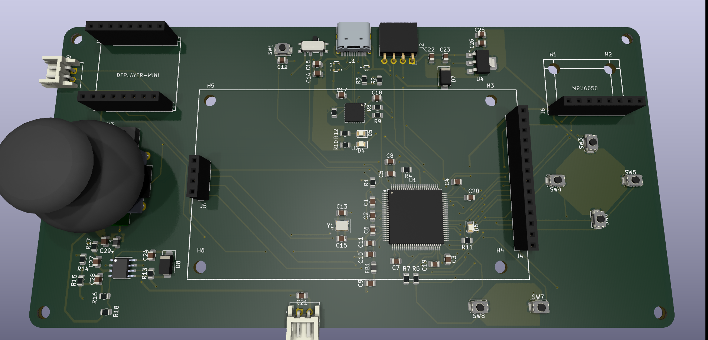
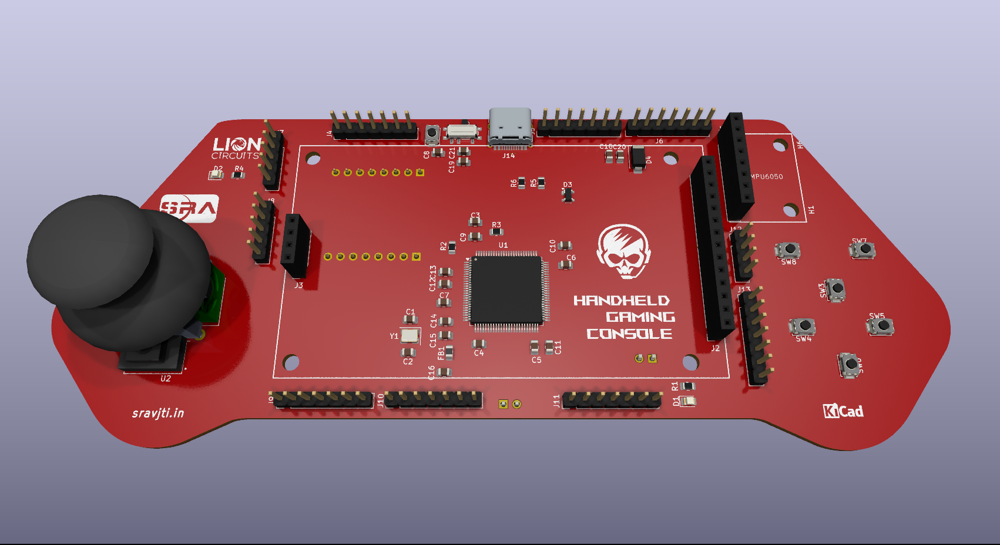
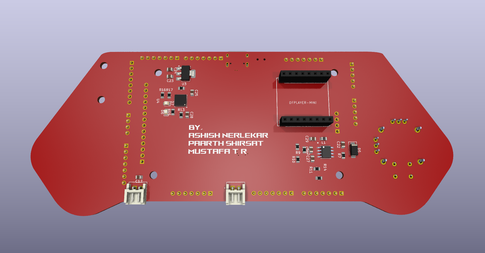
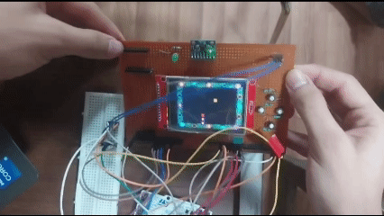
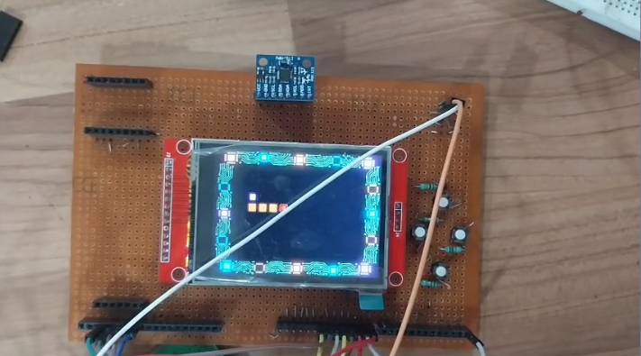

# Handheld Gaming Console

---

A Custom STM32-based Board that runs simple games on an LCD, with various peripherals such as IMU, DF-Player Mini, Buttons, Joystick and a Power System.

## PCB Iterations
---
### OLD PCB
---


### NEW PCB
---
             

## Table Of Contents

---

- [About The Project](https://www.notion.so/Handheld-Gaming-Console-262c2ce1d82a8056936ad801bb8c6b92?pvs=21)
    - [Tech Stack](https://www.notion.so/Handheld-Gaming-Console-262c2ce1d82a8056936ad801bb8c6b92?pvs=21)
    - [File Structure](https://www.notion.so/Handheld-Gaming-Console-262c2ce1d82a8056936ad801bb8c6b92?pvs=21)
- [Getting Started](https://www.notion.so/Handheld-Gaming-Console-262c2ce1d82a8056936ad801bb8c6b92?pvs=21)
    - [Prerequisites](https://www.notion.so/Handheld-Gaming-Console-262c2ce1d82a8056936ad801bb8c6b92?pvs=21)
        - [Hardware](https://www.notion.so/Handheld-Gaming-Console-262c2ce1d82a8056936ad801bb8c6b92?pvs=21)
        - [Software](https://www.notion.so/Handheld-Gaming-Console-262c2ce1d82a8056936ad801bb8c6b92?pvs=21)
    - [Installation](https://www.notion.so/Handheld-Gaming-Console-262c2ce1d82a8056936ad801bb8c6b92?pvs=21)
- [Usage](https://www.notion.so/Handheld-Gaming-Console-262c2ce1d82a8056936ad801bb8c6b92?pvs=21)
- [Results & Demo](https://www.notion.so/Handheld-Gaming-Console-262c2ce1d82a8056936ad801bb8c6b92?pvs=21)
- [Future Work](https://www.notion.so/Handheld-Gaming-Console-262c2ce1d82a8056936ad801bb8c6b92?pvs=21)
- [Contributors](https://www.notion.so/Handheld-Gaming-Console-262c2ce1d82a8056936ad801bb8c6b92?pvs=21)
- [Acknowledgements & Resources](https://www.notion.so/Handheld-Gaming-Console-262c2ce1d82a8056936ad801bb8c6b92?pvs=21)

## About The Project

---

The Handheld Gaming Console is a custom made Printed Circuit Board which utilizes STM32F407VGT6 as its MCU controlling all of the peripherals. The firmware involves setting up all the components and utilizing them to run simple games with the help of controlling hardware such as buttons, joystick and IMU.
The firmware for this project is a bare-metal implementation built on a Hardware Abstraction Layer (HAL). This project is designed to provide hands-on experience and a deep understanding of the embedded development workflow.

This repository will provide all the firmware, PCB files, and steps to use those.

### Tech Stack

---


### File Structure

---

```jsx
Handheld-Gaming-Console/
├── DFPLAYER/
│   ├── dfplayer.c
│   └── dfplayer.h
│
├── HANDHELD/
│   ├── ASSETS/
│   ├── DRIVERS/
│   ├── SRC/
│   └── README.md
│
├── HandHeld-Gaming-Console/
│   ├── .settings/
│   ├── Core/
│   ├── Debug/
│   ├── Drivers/
│   ├── .cproject
│   ├── .mxproject
│   ├── .project
│   ├── HandHeld-Gaming-Console.ioc
│   ├── STM32F407VGTX_FLASH.ld
│   └── STM32F407VGTX_RAM.ld
│
├── Handheld-Nucleo/
│   ├── .settings/
│   ├── Core/
│   ├── Debug/
│   ├── Drivers/
│   ├── CMSIS/
│   ├── GAME/
│   ├── GAME2/
│   ├── MPU6050/
│   ├── STM32F4xx_HAL_Driver/
│   ├── TFT/
│   ├── .cproject
│   ├── .mxproject
│   ├── .project
│   ├── Handheld-Nucleo Debug.launch
│   ├── Handheld-Nucleo.ioc
│   ├── STM32F401RETX_FLASH.ld
│   └── STM32F401RETX_RAM.ld
│
├── PCB Files/
│   ├── HGC PCB.kicad_pcb
│   ├── HGC PROJECT.kicad_pro
│   └── HGC SCHEMATIC.kicad_sch
│
├── UART/
│   ├── uart.c
│   └── uart.h
│
└── README.md
```

## Getting Started

---

### Prerequisites

---

- Hardware
    - STM32 Microcontroller (STM32 Bluepill or Nucleo-F401RE for development)
    - ST-Link V2 or USB-to-TTL adapter (for testing/debugging)
    - Display Driver: ILI9341
    - IMU: MPU6050 (Integrated 6-axis MotionTracking device)
    - MP3 Module: DF-Player Mini
    - Joystick and Buttons
    - Speaker
- Software
    - STM32CubeIDE
    - STM32CubeProgrammer
    - PuTTY (For Serial Monitor)
    - KiCad

### Installation

---

1. Clone the repository

```jsx
git clone https://github.com/Paarth-Shirsat/Handheld-Gaming-Console.git
```

## Usage

---

Steps to flash firmware

1. Connect the console (PCB) to your computer via USB to type C cable.
2. Start the STM32CubeProgrammer.
- By using UART
    1. Select ‘UART’ from the drop-down in the top right. Select the port and set baudrate to ‘115200’ Bd.
    2. Go to ‘Erasing & Programming’ section from the far left part.
    3. Select file path of the ‘.bin’ file from the project folder (search in the ‘Debug’ folder). 
    4. Now, set the BOOT0 pin to high by flicking the switch and click ‘Connect’.
    5. After connecting successfully, click on the ‘Start Programming’ option to start uploading the firmware. A few pop-ups would appear and the board will disconnect automatically.
    6. Now, set the BOOT0 pin to low by again flicking the switch to initial position. Press the ‘Reset’ button on the PCB. You can safely remove the USB to type C cable.
- By using ST-Link
    1. Select ‘UART’ from the drop-down in the top right. Select ‘Serial Number’ and set ‘Port’ as SWD (Serial Wire Debug).
    2. Go to ‘Erasing & Programming’ section from the far left part.
    3. Select file path of the ‘.bin’ file from the project folder (search in the ‘Debug’ folder). 
    4. After the pop-up for flashing of firmware successfully comes, you can safely remove the USB to type C cable.

## Results & Demo

---

Videos of working prototypes are as follows:

Video of Game’s working:





## Future Work

---

- [ ]  Addition of sound system

## Contributors

---

- [Ashish Nerlekar](https://github.com/ashish4225)
- [Mustafa T. R.](https://github.com/mt-tass)
- [Paarth Shirsat](https://github.com/Paarth-Shirsat)

## Acknowledgements & Resources

---

- SRA VJTI Eklavya 2025
- Mentors
    - [Vishal Mutha](https://github.com/Vishal-Mutha)
    - [Piyush Patle](https://github.com/PiyushPatle26)
    - [Shaurya Rane](https://github.com/shauryarane05)
- Resources
    - Datasheets for MCU and peripherals utilized.
    - Repository for ILI9341 Library: [Repository Link](https://github.com/afiskon/stm32-ili9341)
